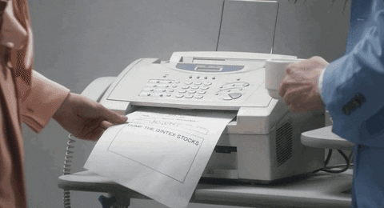

# Bureau Valley


L'énoncé se trouve dans le fichier [gist.md](gist.md).
## Stack
- Java 11 (coretto)
- Maven
- JUnit
- Airlines
## Application & arguments
Quelques commandes pour démarrer/build l'application
* ``mvn test`` : Démarre JUnit test
* ``java --jar fr.lphn.esgi.cleancode.ocr-1.0-SNAPSHOT-jar-with-dependencies.jar`` : démarre Bureau Valley en mode console
### Arguments
* ``--silent``/``-s``: Démarre Bureau Valley en mode silencieux
* ``--input``/``-i``: fichier(s) d'entrée
* ``--all-output``/``-a``: fichier de sortie
* ``--authorized-output``/``-o``: fichier de sortie des lettres valides
* ``--illegal-output``/``-l``: fichier de sortie des lettres non identifiés
* ``--wrong-output``/``-w``: fichier de sortie des lettres dont le checksum n'est pas égal à 11
### Exemples
```shell
$  -i "input.txt" -a output.txt
123456789
123456789
Input is not a number
Input is not a number
12?13678? ILL
Input is not a number
Input is not a number
12?13678? ILL
```

```shell
$ --silent -i "input.txt" -a output.txt
(aucune entrée)
```

```shell
$ -i "input.txt" -o authorized.txt -l illegal.txt -w wrong.txt
123456789
123456789
Input is not a number
Input is not a number
12?13678? ILL
Input is not a number
Input is not a number
12?13678? ILL
```

## Ressources

* ``asset/OCR.TXT``: un fichier d'exemple

## Contributeurs
* Florian GUSTIN
* Cédric LEPROHON
